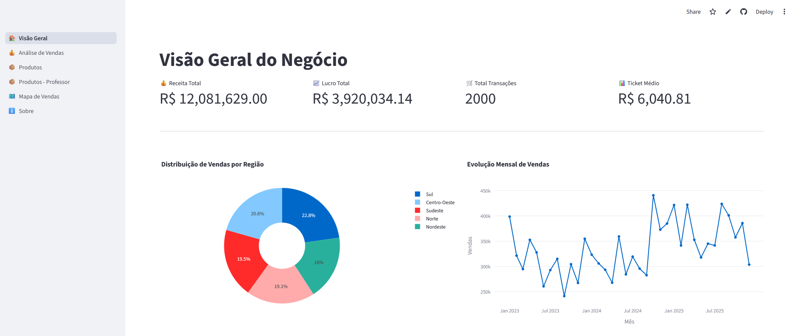
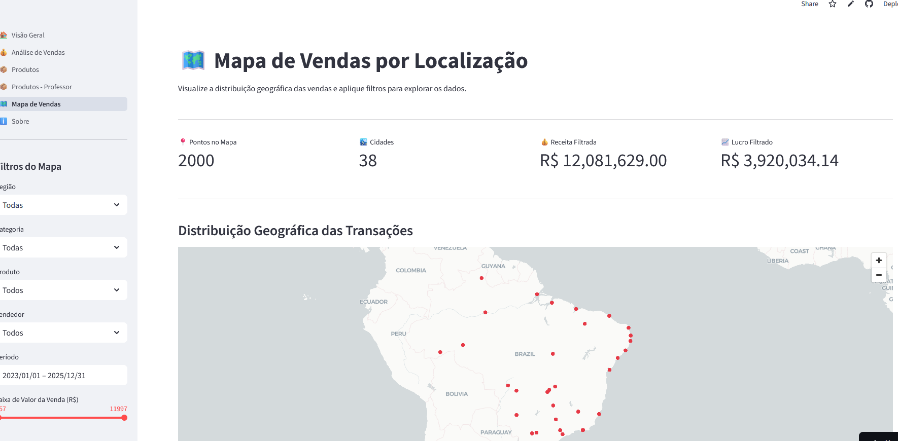

<div align="center">

# 📊 Dashboard de Análise de Vendas

### Plataforma interativa multipáginas para análise de dados comerciais


</div>

---

## 🗂️ Índice

- [Sobre o Projeto](#-sobre-o-projeto)
- [Capturas de Tela](#-capturas-de-tela)
- [Funcionalidades](#-funcionalidades)
- [Tecnologias Utilizadas](#-tecnologias-utilizadas)
- [Estrutura do Projeto](#-estrutura-do-projeto)
- [Como Executar](#-como-executar)
- [Páginas do Dashboard](#-páginas-do-dashboard)

---

## 💡 Sobre o Projeto

Este projeto é um **dashboard interativo de análise de vendas** desenvolvido com **Streamlit**, voltado para a visualização e exploração de dados comerciais de uma empresa fictícia brasileira.

A aplicação permite acompanhar **KPIs de negócio**, analisar tendências temporais, comparar desempenho por região, produto e vendedor, além de visualizar a **distribuição geográfica** das transações em um mapa interativo.

> Projeto desenvolvido como trabalho final de curso, demonstrando o uso de Python para criação de dashboards analíticos.

---

## 🖼️ Capturas de Tela

### 🏠 Visão Geral do Negócio
Painel principal com KPIs, distribuição de vendas por região e evolução mensal.


> _KPIs: Receita Total, Lucro Total, Total de Transações e Ticket Médio. Gráfico de rosca por região e linha temporal de vendas._

### 🗺️ Mapa de Vendas por Localização
Visualização geográfica das transações com filtros por região, categoria, produto, vendedor e período.


> _Distribuição de 2.000 pontos de venda em 38 cidades pelo território brasileiro._

---

## ✨ Funcionalidades

- 📈 **KPIs em tempo real** — Receita, Lucro, Transações e Ticket Médio
- 🔍 **Filtros dinâmicos** — Região, Categoria, Produto, Vendedor e Período
- 🌎 **Mapa interativo** — Geolocalização das vendas com pydeck
- 📊 **Gráficos interativos** — Barras, linhas, pizza, área e mapas de calor (Plotly)
- 📦 **Análise por produto** — Desempenho individual com evolução temporal
- 🗂️ **Múltiplas páginas** — Navegação fluida entre seções independentes

---

## 🛠️ Tecnologias Utilizadas

| Tecnologia | Versão | Finalidade |
|---|---|---|
| 🐍 **Python** | 3.10+ | Linguagem base |
| 🌐 **Streamlit** | — | Framework para o dashboard web |
| 🐼 **Pandas** | 2.x | Manipulação e análise de dados |
| 📊 **Plotly** | 6.x | Visualizações interativas |
| 🗺️ **Pydeck** | 0.9.x | Mapas geoespaciais |
| 🔢 **NumPy** | 2.x | Computação numérica |
| 🏹 **Altair** | 6.x | Visualizações declarativas |

---

## 📁 Estrutura do Projeto

```
projeto_final_dashboard/
│
├── 📄 app.py                          # Ponto de entrada — configuração e navegação
├── 📄 gerar_dados.py                  # Script para geração dos dados de vendas
├── 📄 gerar_dados_geolocalizacao.py   # Script para geração dos dados geoespaciais
├── 📄 requirements.txt                # Dependências do projeto
│
├── 📂 dados/
│   ├── vendas.csv                     # Dataset principal de vendas
│   ├── vendas_geolocalizacao.csv      # Dataset com coordenadas geográficas
│   └── vendas_geo_resumo.csv          # Resumo agregado por localidade
│
└── 📂 pages/
    ├── visao_geral.py                 # 🏠 Painel principal com KPIs
    ├── analise_vendas.py              # 💰 Análise detalhada de vendas
    ├── analise_produtos.py            # 📦 Análise por produto
    ├── analise_produtos_professor.py  # 📦 Versão de referência (professor)
    ├── mapa_vendas.py                 # 🗺️ Mapa geográfico de vendas
    └── sobre.py                       # ℹ️ Informações sobre o projeto
```

---

## 🚀 Como Executar

### Pré-requisitos

- Python 3.10 ou superior instalado
- `pip` disponível no terminal

### Passo a Passo

```bash
# 1. Clone o repositório
git clone https://github.com/seu-usuario/projeto_final_dashboard.git
cd projeto_final_dashboard

# 2. Crie e ative o ambiente virtual
python -m venv venv

# Windows
venv\Scripts\activate

# Linux / macOS
source venv/bin/activate

# 3. Instale as dependências
pip install -r requirements.txt

# 4. (Opcional) Regenere os dados sintéticos
python gerar_dados.py
python gerar_dados_geolocalizacao.py

# 5. Execute o dashboard
streamlit run app.py
```

Acesse em seu navegador: **http://localhost:8501**

---

## 📑 Páginas do Dashboard

### 🏠 Visão Geral
Panorama executivo do negócio com os principais indicadores:
- **Receita Total**, **Lucro Total**, **Total de Transações** e **Ticket Médio**
- Gráfico de rosca com distribuição de vendas por região
- Gráfico de linha com evolução mensal de vendas

### 💰 Análise de Vendas
Análise detalhada e filtrada das vendas:
- Filtros por **Região**, **Categoria** e **Período**
- Ranking de vendas por vendedor e por produto
- Comparativo de desempenho ao longo do tempo

### 📦 Análise de Produtos
Visão focada no desempenho de produtos individuais:
- Seleção de produto com métricas de Receita, Lucro, Quantidade e Preço Médio
- Vendas por região e por vendedor
- Evolução temporal das vendas do produto

### 🗺️ Mapa de Vendas
Distribuição geográfica das transações pelo Brasil:
- Filtros completos por Região, Categoria, Produto, Vendedor e Período
- Slider de faixa de valor da venda
- Mapa interativo com pontos de venda geolocalizados

### ℹ️ Sobre
Desenvolvido por: André de Oliveira Santana

---

<div align="center">

Feito com ❤️ usando [Streamlit](https://streamlit.io) · Python · Plotly

</div>

